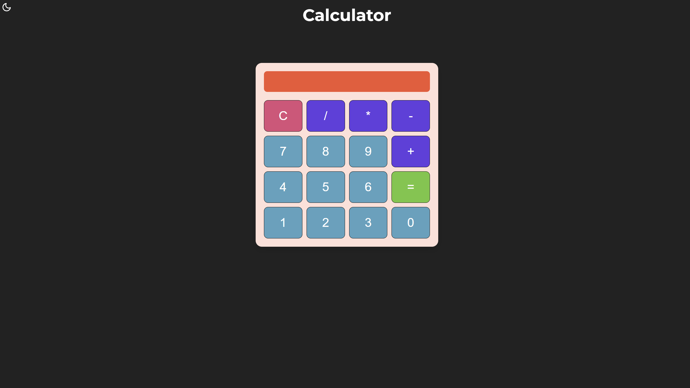

# Calculator

### Interactive Calculator with Keyboard Support & Theme Toggle

> A clean and responsive calculator built using **HTML, CSS, and JavaScript**, focused on strengthening core frontend skills and adding real-world UI features.

---

## Overview

This project is a **JavaScript practice application** that implements a fully functional calculator with:

- Dynamic input handling
- Smooth UI interactions
- Theme switching (Dark ↔ Light)
- Keyboard support for faster usage

---

## 📁 Project Structure

```bash
calculator-app/
├── index.html
├── style.css
├── calc.js
└── assets/
    └── icons (optional)
```

---

## Features

### Core Functionality

- Basic arithmetic operations (+, −, ×, ÷)
- Real-time display updates
- Clear and delete (backspace) functionality

### UI & UX

- Responsive layout using **CSS Grid & Flexbox**
- Smooth hover effects and transitions
- Clean and minimal design

---

## Keyboard Support

Users can interact with the calculator using the keyboard:

| Key       | Action            |
| --------- | ----------------- |
| 0–9       | Enter numbers     |
| + - \* /  | Operators         |
| Enter / = | Calculate result  |
| Backspace | Delete last input |
| Esc       | Clear display     |

---

## 🌗 Theme Toggle (Dark / Light)

- Default theme: **Dark Mode**
- Toggle using a **custom SVG icon (Sun / Moon)**
- Uses **CSS class switching** (`.light-theme`)
- Theme preference stored using **localStorage**

---

## Tech Stack

| Layer     | Tech                 |
| --------- | -------------------- |
| Structure | HTML5                |
| Styling   | CSS3 (Grid, Flexbox) |
| Logic     | Vanilla JavaScript   |
| Storage   | localStorage         |
| Icons     | SVG                  |

---

## 🧩 Key Concepts Practiced

- DOM Manipulation
- Event Handling
- State Management (inputs & operations)
- CSS Layout Systems
- UI Transitions & Animations
- SVG icon formation

---

## 🚀 Run Locally

```bash
git clone https://github.com/Dharshinimk-521/calculator-js.git
cd calculator-app
open index.html
```

---

## Preview

## 

## 🔮 Future Improvements

- [ ] Keyboard visual feedback (button highlight)
- [ ] Advanced operations (%, √, etc.)
- [ ] History panel
- [ ] Smooth theme transition animations

---

## Extra Implementations

- **Theme Toggle using SVG icons**
- Built custom Sun & Moon icons using SVG
- Dynamically switched icons and theme using JavaScript
- Stored user preference with `localStorage`

- **Full Keyboard Support**
- Enabled calculator input via keyboard
- Mapped keys to functions (numbers, operators, actions)
- Added handling for Enter, Backspace, and Escape

---

## Note

This project was built as part of my **JavaScript practice journey**, focusing on improving problem-solving skills, UI design, and interactive web development.

---
